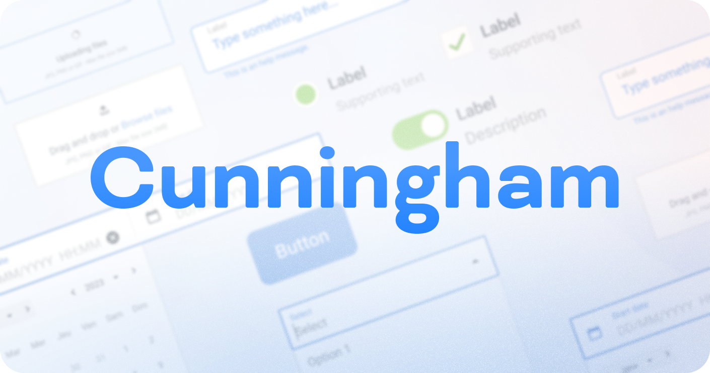
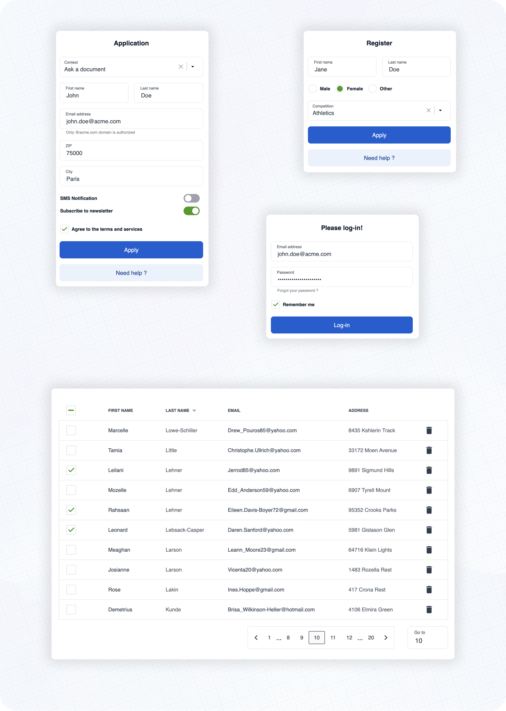

<div align="center">
  <a href="https://openfun.github.io/cunningham"></a>
</div>

<div align="center">

# Cunningham

**A design system and a components library.**

<a href="https://openfun.github.io/cunningham"><b>📚&nbsp;&nbsp;Documentation</b></a> •
<a href="https://www.figma.com/file/JbPT1R6YUFW4oH8jHvH960/DS-Cunningham---PUBLIC?type=design"><b>🖌️&nbsp;&nbsp;Figma</b></a>

</div>

- **Atomic**: We follow [atomic design principles](https://bradfrost.com/blog/post/atomic-web-design/).
- **Modular and Reusable**: Each component is designed to be self-contained and reusable across different projects, promoting consistency and saving development time.
- **Accessibility-focused**: Our components prioritize accessibility standards, making them usable and inclusive for all users.
- **Design tokens based**: We use [design tokens](https://openfun.github.io/cunningham/?path=/docs/getting-started-customization--docs#what-are-design-tokens-) to ensure consistency between design and code and allow high customization.
- **React** based: at the moment we only support React, but we are open to other frameworks, feel free to [contribute](./CONTRIBUTING.md) !

<div align="center">

[](https://circleci.com/gh/openfun/cunningham/tree/main)
[](https://discord.gg/3qjUJjp)

</div>

## 🔎 Preview

Here are some examples of real life usage of Cunningham components.

<a href="https://openfun.github.io/cunningham"></a>

<div align="center">

See the [documentation](https://openfun.github.io/cunningham) 📚 to learn more about customization, typography, spacings and available components!

</div>

## ⚡️ Getting started

➡️ First, install the library

```
yarn add @openfun/cunningham-react
```

➡️ Then, add this script to your `package.json` file

```json
{
  "scripts": {
    "build-theme": "cunningham -g css -o src"
  }
}
```

➡️ Then, in order to generate the css file, run

```
yarn build-theme
```

It will generate a file named `cunningham-tokens.css`.

➡️ Then, add these lines at the top of your main stylesheet file:

```
@import "@openfun/cunningham-react/fonts"; // Imports default fonts ( Roboto ). You can also import fonts by yourself.
@import "@openfun/cunningham-react/icons"; // Imports icons ( Material Icons ).
@import "@openfun/cunningham-react/style"; // Imports the default theme.
@import "cunningham-tokens"; // Imports the file you just generated.
```

> Please take a look at [customization documentation](https://openfun.github.io/cunningham/?path=/docs/getting-started-customization--docs) for more informations about the `cunningham` command line tool and to customize your local theme.

We're done! 🎉

To ensure everything works well, let's test rendering a component, such as the [Button](https://openfun.github.io/cunningham/?path=/docs/components-button--docs) for example.

Now please see the [documentation](https://openfun.github.io/cunningham) 📚 to learn more about customization, typography, spacings and available components!

## Contributors

<a href="https://github.com/openfun/cunningham/graphs/contributors">
  
</a>

## Contributing

This project is intended to be community-driven, so please, do not hesitate to get in touch if you have any question related to our implementation or design decisions.

Please see our [contributing guidelines](./CONTRIBUTING.md).

## License

This work is released under the MIT License (see [LICENSE](./LICENSE)).
